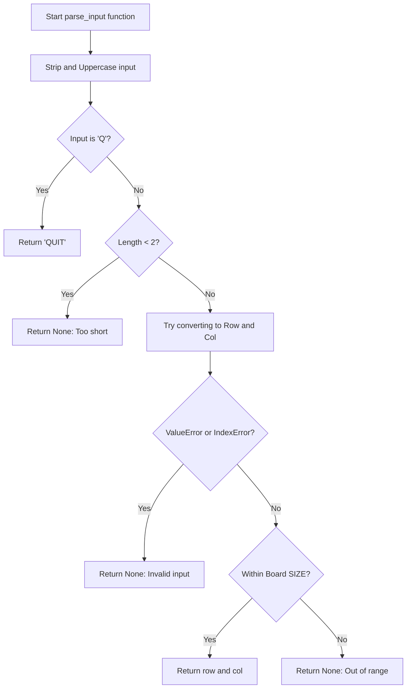
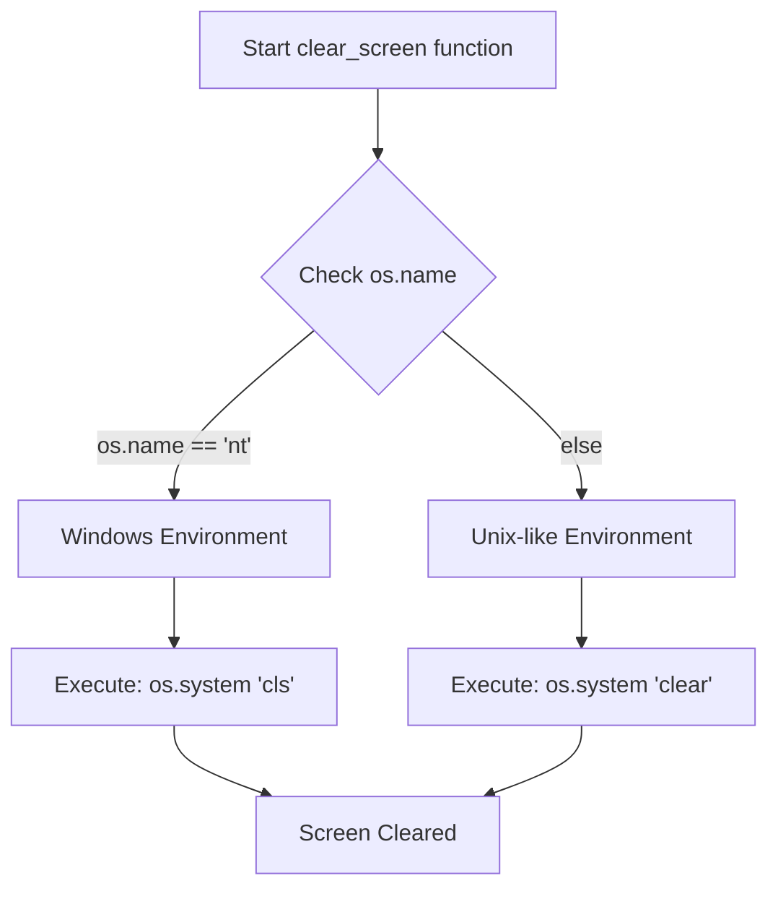
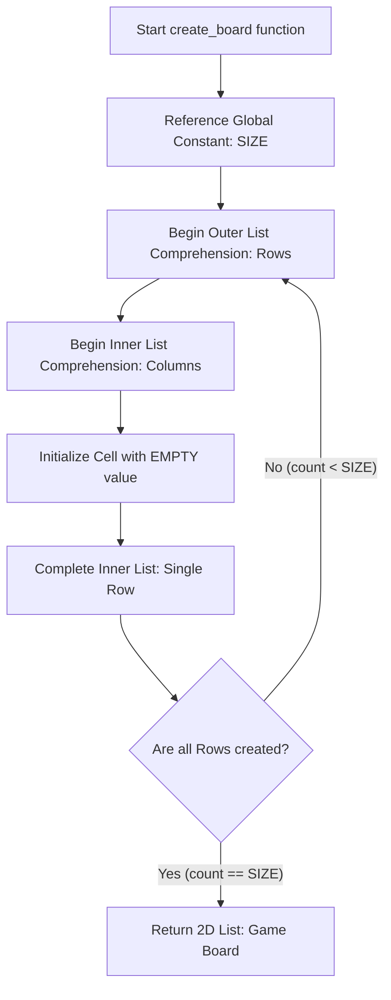
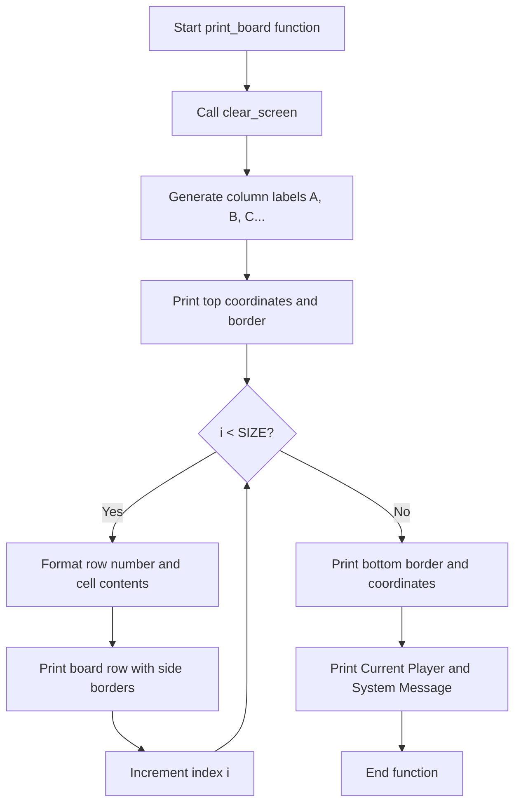
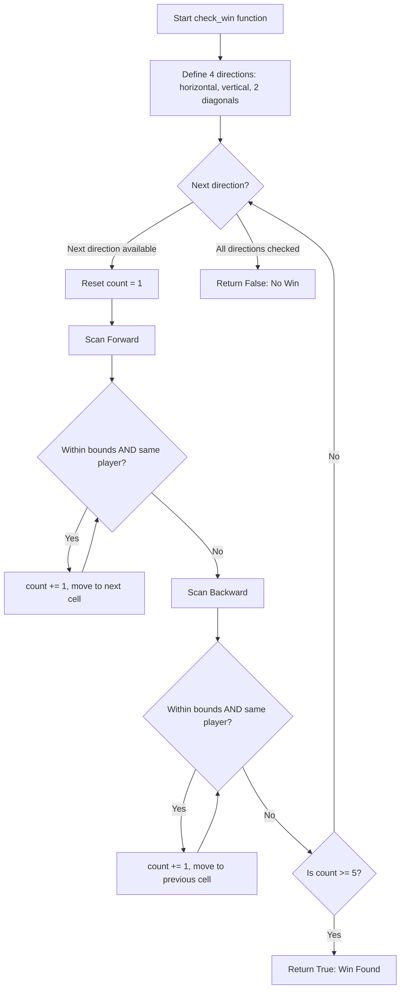
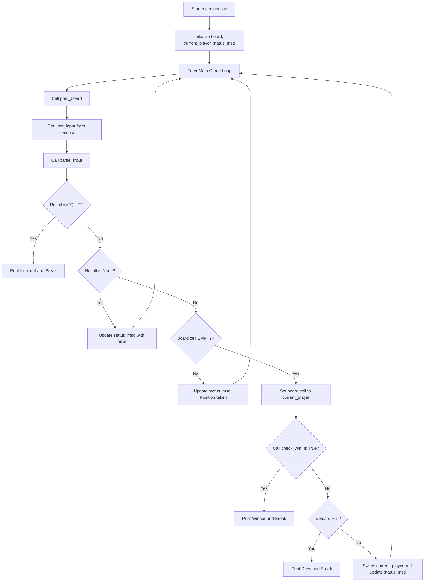

<style>
.markdown-body {
    background-color: #0d1117 !important;
    color: #c9d1d9 !important;
}

@media print {
    html, body {
        background-color: #0d1117 !important;
        color: #c9d1d9 !important;
        margin: 0 !important;
        padding: 0 !important;
        height: 100%;
        -webkit-print-color-adjust: exact;
        print-color-adjust: exact; 
    }
    @page {
        margin: 0;
        background-color: #0d1117;
    }
    .markdown-body {
        padding: 2cm !important;
        background-color: #0d1117 !important;
        min-height: 100vh;
    }
}
</style>

# HKDSE ICT SBA Gomoku Project Technical Document

Written by Sarosaka.

-------

[TOC]

## Section 1 : Introduction

This is a technical document for my school-based assessment (SBA) Gomoku project. The program is based on the *Python 3.14.3* interpreter and can be executed within *Windows Terminal* and *macOS/Linux terminal environments* with the support of a *Python (>=3.14.3)* interpreter.

The program's core function is to spawn a standard 15×15 Gomoku chessboard and supports a coordinate-based method for placing the chess pieces. Other basic functions include automatic winner recognition and terminal screen refreshing.

The program's development environment is standard *Python 3.14.3* under *Arch Linux x86_64*, and it does not require any external third-party libraries.

## Section 2 : Data & Variables

In this section, I will explain how I store the game's status.

### Section 2 Part 1 : General Data Storage

Board representation: utilizes a 2-dimensional array to initialize the board as empty. The rationale for choosing a 2-dimensional array is the easy accessibility of the data through `board[row][col]`.

The data access code example below is from the *winner recognition* part.

```Python
while 0 <= nr < SIZE and 0 <= nc < SIZE and board[nr][nc] == p:
```

Status variables: In the code, I configured 2 main global variables for game experience optimization.   
`current_player` is utilized to store the currently playing player, used for win validation and the message system.   
`status_msg` acts as a temporary buffer for the game's status, printed out when an event occurs during the gameplay. The reason we require a temporary buffer is that we need a variable to retain the status message even after the terminal screen has been cleared. Following the clearance, `status_msg` provides the message to be displayed on the subsequent game frame.

### Section 2 Part 2 : Detailed Variables


| Variables | Position | Usage | Type |
| :--- | :--- | :--- | :--- |
| SIZE | Global | Board dimensions | Integer |
| BLACK | Global | Player 1's marker | Character |
| WHITE | Global | Player 2's marker | Character |
| EMPTY | Global | Unoccupied position | Character |
| board | print_board() | General board data | 2D array |
| status_msg | print_board() | Event and error output | String |
| current_player | print_board() | Current player's piece | Character |
| input_str | parse_input() | Coordinate input | String |
| rowc | check_win() | Row index for checking | Integer |
| column | check_win() | Column index for checking | Integer |
| change_r | check_win() | Row offset for checking | Integer |
| change_c | check_win() | Column offset for checking | Integer |
| directions | check_win() | Movement vectors | Array |
| new_r | check_win() | Updated row number | Integer |
| new_c | check_win() | Updated column number | Integer |
| player | check_win() | Check's start point | Array |
| row | main loop | Parsed row value | Integer |
| col | main loop | Parsed column value | Integer |


## Section 3 : Module Composition

In this section, I will explain how my program operates and its core algorithms, while providing some code snippets.

### Section 3 Part 1 : Parsing Input

The first part involves the method of parsing the user's input into components that the program can comprehend. In this phase, the user will type their potential coordinates into the terminal, such as A8 or H8. However, the algorithm cannot directly process the position, so we must parse it and translate them into array offsets.

```Python
def parse_input(input_str):
    s = input_str.strip().upper()
    if s == 'Q':
        return 'QUIT', ""
```

This segment of the code initially accepts the user's input and checks if the user is requesting to interrupt and exit the program by verifying if the input matches the exit signal `"Q"`.

```Python
    if len(s) < 2:
        return None, "Coordinate too short."
```

This segment subsequently processes the user's input if the request is not to interrupt and quit. It verifies the input's length to ensure it is sufficient to proceed; otherwise, it returns `None` and requires the user to re-enter the coordinates.

```Python
    try:
        col = ord(s[0]) - ord('A')
        row = int(s[1:]) - 1
        
        if 0 <= col < SIZE and 0 <= row < SIZE:
            return (row, col), ""
        else:
            return None, "Coordinate out of range."
    except (ValueError, IndexError):
        return None, "Invalid input."
```

This is the error-handling segment. It utilizes the `try-except` mechanism for catching and handling exceptions, determining whether to redirect the program flow or simply halt the execution and prompt the end-user. The `try-except` method offers several benefits over traditional error handling:

1. The code is clearer and easier to read than a bunch of `if-else` statements, benefiting future extension and maintenance.
2. `try-except` can easily catch runtime errors without crashing the entire program, displaying an error message instead.
3. The usage of this error handling methodology embodies a famous philosophy in the *Python* world: *EAFP* (*Easier to Ask for Forgiveness than Permission*).

If the user attempts to input out-of-range values, it will return `None` and instruct the user to input again, without terminating the program itself.

Below is the flowchart of this part of the code.



### Section 3 Part 2 : Clearing Screen

Tired of scrolling down the terminal page? The `os` module has you covered.

```Python
def clear_screen():
    os.system('cls' if os.name == 'nt' else 'clear')
```

This snippet occupies very little space in the entire script, but it significantly improves the gaming experience. Rather than continuously scrolling down the terminal output, it automatically clears the screen, keeping your focus on the chessboard.

The core logic involves checking the OS type and subsequently sending the correct clearing command to the terminal emulator. If the value of `os.name` is `nt` (an abbreviation for *Windows NT*, or more commonly the standard *Windows* we use today), it executes the corresponding command. Otherwise, the program identifies the environment as a *POSIX Compliant System*, such as *macOS*, *UNIX*, or *Linux*.

Below is the flowchart of this part of the code.



### Section 3 Part 3 : Creating Board

This section of the code simply creates a two-dimensional array utilized for storing the chessboard data.

```Python
def create_board():
    return [[EMPTY for _ in range(SIZE)] for _ in range(SIZE)]
```

Below is the flowchart of this part of the code.



### Section 3 Part 4 : Board Rendering

In this segment, the program prints or displays the board on the current terminal screen.

Below is the first part of the code. It initially defines the function so it can be utilized in the main program. It then calls the `clear_screen` function to wipe the terminal output, keeping the screen clean to enhance the gaming experience.

```Python
def print_board(board, status_msg, current_player):
    clear_screen()
```
After clearing the screen, the program generates the 15 letters utilized by the board, and then prints the board by appending line break characters (`\n`) and spaces. It subsequently uses `-` as a symbol to render the chessboard's border.

```Python
    letters =[chr(ord('A') + i) for i in range(SIZE)]
    print("\n      " + " ".join(letters))
    print("     +" + "--" * SIZE + "+")
```

In the subsequent block of code, the script initiates a `for` loop, utilizing `i` as a local variable and the global variable `SIZE` as the loop's range. It then defines `row_num` and `row_content`. These two local variables assist the script in adjusting the alignment of the row. Following that, `row_content` helps us format the chess pieces' positional data from the two-dimensional array we created. Moreover, the `print` function outputs the position indicators (e.g., A5 or H6) along the border.

```Python
    for i in range(SIZE):
        row_num = str(i + 1).rjust(2)
        row_content = " ".join(board[i])
        print(f" {row_num} | {row_content} | {row_num}")
```
Following this block, the script invokes the `print` function twice to display the bottom border of the chessboard.

```Python
    print("     +" + "--" * SIZE + "+")
    print("      " + " ".join(letters))
```
Additionally, the script calls the `print` function three times to output the `Current Player`, `System Msg` (abbreviation for message), and a visual separator. This is a core component of the script as it provides an enhanced experience for the player, serving as a pipeline for monitoring the game state, events, or potential errors. We must include these `print` statements within `print_board` to retain them on the screen after invoking `clear_screen` during board refreshes.

```Python
    print(f"\n[ Current Player ]: {current_player}")
    print(f"[ System Msg ]: {status_msg}")
    print("-" * 40)
```

Below is the flowchart of this part of the code.



### Section 3 Part 5 : Winner Checking

In this section, we will dissect the core algorithm of the Gomoku script: the winner-checking module.

The most straightforward and brute-force way to check the winner is to scan the entire chessboard, searching for 5 consecutive pieces, whether in a row, a column, or diagonally.

What is the drawback of scanning the entire chessboard? The primary issue is poor performance. Although modern computers easily handle such minor unoptimized tasks, systemic performance degradation is often the accumulation of minor inefficiencies. Therefore, I opted to implement a superior method for verifying the winner: *local checking*.

The core logic of *local checking* is to choose a starting point, and then inspect the 4 axes (horizontal, vertical, and both diagonals) originating from the starting point. 

In this script, the starting point is the most recently placed piece by the `current_player`. The function then evaluates the 4 axes, which are represented by 4 corresponding tuples in the code.

```Python
def check_win(board, rowc, column, player):
    directions =[(0, 1), (1, 0), (1, 1), (1, -1)]
```
After that, the script calls a `for` loop, utilizing `change_r` and `change_c` as variables—representing the *row delta* and *column delta*—while iterating over the `directions` sequence to verify every possible directional axis combination.

Then, it will initialize the counter, or in another way, set `count` equal to 1. I initialized it at 1 rather than 0 because the newly placed piece counts as the first of the 5 requisite pieces.

```Python
    for change_r, change_c in directions:
        count = 1
```

Additionally, it performs a process known as *forward searching*. It progressively steps forward (applying `change_r` and `change_c`) until the updated coordinates fall out of bounds, encounter an empty cell, or hit a piece not belonging to the current player.

```Python
        new_r, new_c = rowc + change_r, column + change_c
        while 0 <= new_r < SIZE and 0 <= new_c < SIZE and \
            board[new_r][new_c] == player:
            count += 1
            new_r += change_r
            new_c += change_c
```

Subsequently, the script mirrors this operation in the exact opposite direction.

```Python
        new_r, new_c = rowc - change_r, column - change_c
        while 0 <= new_r < SIZE and 0 <= new_c < SIZE and \
            board[new_r][new_c] == player:
            count += 1
            new_r -= change_r
            new_c -= change_c
```

In the final segment, an `if` statement conducts a straightforward comparison. If the counter's value equals or exceeds 5 (values greater than 5 are unlikely unless the script is modified), it returns `True`, signaling to the `main` function that the `current_player` has won. Otherwise, it returns `False`, allowing the script to proceed.

```Python
        if count >= 5:
            return True
    return False
```

Below is the flowchart of this part of the code.



## Section 4 : Main Loop

After defining the modules, the most crucial part of the script is the main loop. Within the main loop, the script orchestrates all previously defined functions to deliver a complete gaming experience.

At the very beginning, the main loop will call the `create_board` function to generate a 2D array for storing the chessboard data. It then initializes the `current_player` and `status_msg` variables for subsequent use.

```Python
def main():
    board = create_board()
    current_player = BLACK
    status_msg = f"Player {current_player} please place."
```

After that, the main loop engages a `while` loop to continuously print the board and collect the user's coordinate input. It initializes the `result` and `error_err` variables via the `parse_input` function to evaluate whether the input is valid. Valid inputs are either converted into actionable coordinates for piece placement or processed as termination signals. Upon validation, the script either broadcasts an error message or updates the board state and triggers a screen refresh (by calling the `print_board` function).

```Python
        if result == 'QUIT':
            print("Interrupt signal detected.")
            break
            
        if result is None:
            status_msg = f"Error: {error_err}"
            continue
            
        row, col = result
        
        if board[row][col] != EMPTY:
            status_msg = \
            f"Error: Position {user_input.upper()} is already taken."
            continue
            
        board[row][col] = current_player
```

If the `check_win` function yields `True`, the script halts the loop and broadcasts a message declaring the winner.

```Python
        if check_win(board, row, col, current_player):
            print_board(board, f" Congrats! Player {current_player} wins!",\
            current_player)
            print("GAME OVER")
            break
```

If the chessboard is completely occupied without a winner, the script terminates and outputs a message indicating a draw.

```Python
        if all(cell != EMPTY for row in board for cell in row):
            print_board(board, "It is a draw!", current_player)
            break
```

Towards the conclusion of the main loop, the script executes the logic required to sustain gameplay, primarily updating the `status_msg` and alternating the `current_player` after refreshing the chessboard.

```Python
        status_msg = f"Player {current_player} placed at {user_input.upper()}"
        current_player = WHITE if current_player == BLACK else BLACK
```

Although the main loop definition concludes here, one vital construct remains. The primary purpose of this snippet is to ensure that the `main` loop is triggered only when the script is executed directly from the terminal, preventing unintended output if the file is imported as a module.

This practice enhances the reusability and portability of the script across diverse software platforms and hardware architectures.

```Python
if __name__ == "__main__":
    main()
```

Below is the flowchart of this part of the code.



## Section 5 : Future Development Plan

In this section, I will outline the future development plan for this application.

1. Adding PvE functionality.
PvE is increasingly popular for training purposes. Accordingly, I plan to integrate PvE support into this Gomoku script utilizing AI technologies. Large Language Models (LLMs) will be avoided due to their substantial computational overhead and suboptimal performance in specific logical tasks like playing chess. Potential alternatives include the Minimax algorithm and the Rapfi model.

The Minimax algorithm is a hallmark of Symbolic AI; its fundamental principle relies on mathematical functions and depth-based tree searching.

Conversely, the Rapfi model is currently one of the most formidable open-source AI engines representing Connectionist AI. Based on Convolutional Neural Networks (CNNs), it represents top-tier capabilities in Gomoku gameplay.

2. Enhancing the User Interface (UI).
For example, a dedicated welcome screen is an excellent way to elevate the user experience. 

However, to avoid dependencies on third-party libraries like `pygame`, this script is unlikely to incorporate graphical interfaces, meaning it will remain terminal-based. Users will require a fully functional terminal emulator to enjoy the complete experience; otherwise, features like automated screen clearing and board refreshing may fail to function properly.

## Section 6 : Reusability and Portability

Written in *Python 3.14.3*, the script leverages Python's cross-platform capabilities, enabling its core functionalities to operate on any operating system equipped with a compatible *Python* interpreter (>= 3.14.3).

This script can also be imported as a module, facilitating integration into the broader execution loops of external scripts. 

Testing has been validated on *Arch Linux x86_64* (kernel *linux 6.19.9-arch1-1*) using the *Kitty* emulator, as well as on *Windows 11 25H2* via *Windows Terminal*.
Further compatibility testing is ongoing on *Chimera Linux x86_64* utilizing the *musl C library*, as well as on *aarch64* hardware architectures. 

## Section 7 : References

1. Python 3.14.3 Tutorial, available at https://docs.python.org/3/tutorial/index.html.
2. Windows Terminal Customize Actions, available at https://learn.microsoft.com/zh-tw/windows/terminal/customize-settings/actions.
3. Rapfi main page, available at https://github.com/dhbloo/rapfi.
4. Markdown Tutorial, available at https://markdown.com.cn/.

## Section 8 : Redistribution and Availability

This project is distributed under MIT license.

Project source code and technical document copy are available at https://github.com/sarosaka-orz/HKDSE-ICT-SBA-Gomoku.


